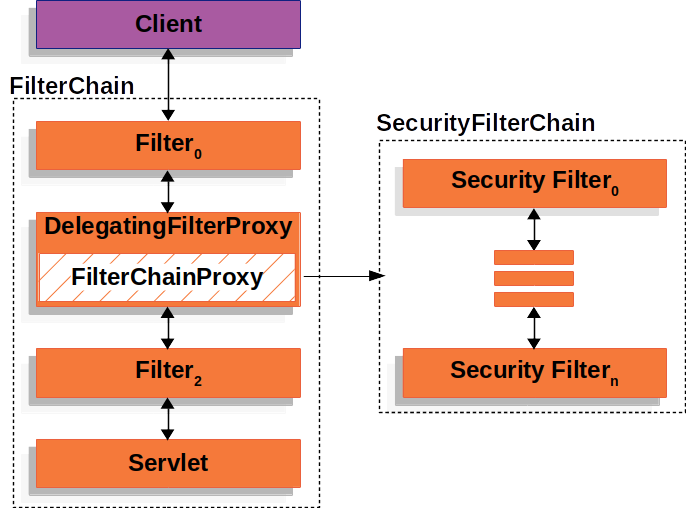

# 6-2. Relational Model

> ### 학습 키워드
>
> * [관계 데이터 모델 용어 정리](6-2.-relational-model.md#undefined)
>   * [속성](6-2.-relational-model.md#attribute)
>   * [튜플](6-2.-relational-model.md#tuple)
>   * [관계](6-2.-relational-model.md#relation)

***

## 관계 데이터 모델 용어 정리


정의 참고 ( [6-1. Database](6-1.-database.md) )


### 속성(Attribute)

* 속성은 이름과 타입으로 구분된다.
  * _ex) 이름/문자열, 나이/정수(2), 성별/문자 등_
* 이름은 집합 안에서 유일해야 한다.
* 주로Column으로 구현된다.

### 튜플(Tuple)

* (속성, 값) 쌍의 집합을 말한다.
  * _ex) { (이름/문자열, 견우), (나이/정수(2), 13), (성별/문자,  남) }_
* 하나의 집합에서 속성 이름은 유일하다.
* 튜플은 중복을 허용하지 않으나, 대부분의 RDBMS 중복을 허용한다.

### 관계(Relation)

<figure><figcaption><p><a href="https://en.wikipedia.org/wiki/Relational_model">https://en.wikipedia.org/wiki/Relational_model</a></p></figcaption></figure>

* (속성의 집합, 튜플의 집합) 쌍의 집합을 말한다.
* 속성의 집합은 Heading, 튜플의 집합을 body라고 한다.
* &#x20;예시

```
(
	// Heading
	{ 이름/문자열, 나이/정수, 성별/문자 },

	// Body
	{
		{ (이름/문자열, 견우), (나이/정수, 13), (성별/문자, 남) },
		{ (이름/문자열,직녀), (나이/정수, 12), (성별/문자, 여) }
	}
)
```
